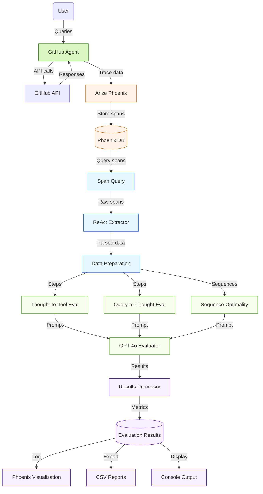
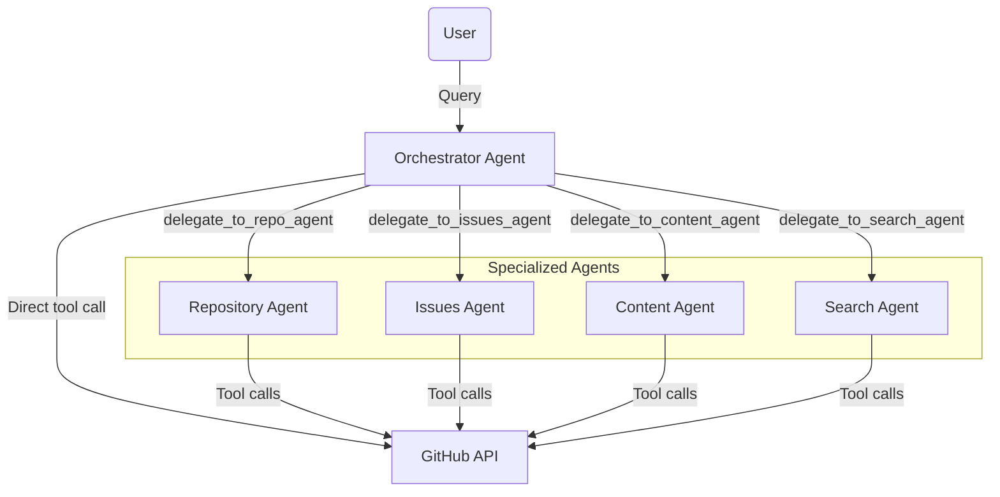

# GitHub Agent Evaluation Framework

A comprehensive evaluation framework for GitHub agents built on LlamaIndex with Arize Phoenix telemetry.

## 📋 Overview

This project implements a robust framework for evaluating GitHub agents, addressing a critical gap in agent system development. It provides automated evaluation of agent reasoning, tool selection, and execution efficiency, supporting both single-agent and multi-agent architectures.

## 🏗️ Architecture

### Evaluation Framework Architecture



### Multi-Agent Architecture



## 🧪 Evaluation Methodology

### Ground Truth Evaluation Example

#### Sample User Query

```
Create a repository under my github account puranjaigarg783 of the same as that of a battlestar galactica character. If a repository of the name of a star trek character already exists, choose a different one, create an issue for adding a README for creating a calculator then commit code and readme for it close the issue after.
```

#### Single Agent Ground Truth

| Step | Thought | Tool Call | Action Input | Evaluation |
|------|---------|-----------|--------------|------------|
| 1 | I need to first check what repositories already exist under puranjaigarg783 to see if any Star Trek character repos exist. | `list_my_repos` | `{}` | ✓ |
| 2 | Now I need to choose a Battlestar Galactica character name for the new repository. I'll check if any of the existing repos are named after Star Trek characters. | `create_repo` | `{"name": "adama", "description": "Repository named after William Adama, a Battlestar Galactica character"}` | ✓ |
| 3 | Now I need to create an issue about adding a README for a calculator. | `open_issue` | `{"repo": "adama", "title": "Add README for calculator", "body": "We need to add a README file with instructions for the calculator implementation."}` | ✓ |
| 4 | I need to add a README with calculator information and commit the code for a calculator. | `commit_file` | `{"repo": "adama", "path": "README.md", "message": "Add README for calculator", "content": "# Calculator\n\nA simple calculator implementation..."}` | ✓ |
| 5 | Now I need to add calculator code to the repository. | `commit_file` | `{"repo": "adama", "path": "calculator.py", "message": "Add calculator implementation", "content": "class Calculator:\n    def add(self, a, b):\n        return a + b..."}` | ✓ |
| 6 | Now that I've added the README and code for the calculator, I need to close the issue. | `close_issue` | `{"repo": "adama", "issue_number": 1}` | ✓ |

**Sequence Optimality Evaluation**: `optimal` - The sequence represents the most efficient approach possible for this task.

#### Multi-Agent Ground Truth

| Step | Agent | Thought | Tool/Agent Call | Action Input | Evaluation |
|------|-------|---------|-----------------|--------------|------------|
| 1 | Orchestrator | This task involves checking repositories, creating a new repository, creating an issue, and managing files. I should first check existing repositories. | `list_my_repos` | `{}` | ✓ |
| 2 | Orchestrator | Now I need to create a new repository with a Battlestar Galactica character name. This is a repository creation task, so I'll delegate to the Repository Agent. | `delegate_to_repo_agent` | `{"task": "Create a new repository named 'adama' (Battlestar Galactica character) for user puranjaigarg783..."}` | ✓ |
| 3 | Repo Agent | I need to create a repository with the name 'adama'. | `create_repo` | `{"name": "adama", "description": "Repository named after William Adama, a Battlestar Galactica character"}` | ✓ |
| 4 | Orchestrator | Now I need to create an issue for adding a README for a calculator. This is an issue management task, so I'll delegate to the Issues Agent. | `delegate_to_issues_agent` | `{"task": "Create an issue in the 'adama' repository about adding a README for a calculator."}` | ✓ |
| 5 | Issues Agent | I'll create the issue in the adama repository for adding a README for a calculator. | `open_issue` | `{"repo": "adama", "title": "Add README for calculator", "body": "We need to add a README file..."}` | ✓ |
| 6 | Orchestrator | Now I need to commit code and a README for a calculator. This is a content management task, so I'll delegate to the Content Agent. | `delegate_to_content_agent` | `{"task": "Add a README.md and calculator.py implementation to the 'adama' repository."}` | ✓ |
| 7 | Content Agent | I'll first add the README file for the calculator. | `commit_file` | `{"repo": "adama", "path": "README.md", "message": "Add README for calculator", "content": "# Calculator\n\nA simple calculator..."}` | ✓ |
| 8 | Content Agent | Now I'll add the calculator implementation. | `commit_file` | `{"repo": "adama", "path": "calculator.py", "message": "Add calculator implementation", "content": "class Calculator:\n    def add(self, a, b)..."}` | ✓ |
| 9 | Orchestrator | Now that the README and calculator code have been added, I need to close the issue. This is an issue management task, so I'll delegate to the Issues Agent. | `delegate_to_issues_agent` | `{"task": "Close issue #1 in the 'adama' repository."}` | ✓ |
| 10 | Issues Agent | I'll close issue #1 in the adama repository. | `close_issue` | `{"repo": "adama", "issue_number": 1}` | ✓ |

**Sequence Optimality Evaluation**: `optimal` - The sequence represents the most efficient approach possible for a multi-agent system. The orchestrator agent properly delegates tasks to specialized agents based on their expertise.

1. **User & Agent Interaction**: Captures interactions between users and GitHub agents
2. **Telemetry & Data Collection**: Records agent reasoning and tool calls via Phoenix tracing
3. **Component Extraction**: Parses ReAct components (thoughts, tool calls, inputs) from telemetry data
4. **Multi-dimensional Evaluation**: Assesses agent performance across three key dimensions
5. **LLM-Based Assessment**: Uses GPT-4o for consistent evaluations with scoring and feedback
6. **Results Processing & Visualization**: Presents findings through Phoenix visualizations, CSV reports, and console output

### Evaluation Dimensions

The framework evaluates agents across three complementary dimensions:

1. **Thought-to-Tool Evaluation**: Assesses whether the agent chose the right GitHub tool based on its stated reasoning
2. **Query-to-Thought Evaluation**: Evaluates if the agent properly understands and plans to address user queries
3. **Sequence Optimality Evaluation**: Determines whether the agent took the most efficient path to accomplish the task

## 🚀 Features

- **ReAct Framework Integration**: Evaluates agents following the Reasoning + Acting paradigm
- **Multi-dimensional Evaluation**: Assesses reasoning, tool selection, and execution efficiency
- **LLM-Based Evaluation**: Uses GPT-4o to evaluate agent performance
- **Phoenix Integration**: Visualizes and logs evaluation results
- **Multi-agent Support**: Evaluates both single agents and multi-agent systems

## 📁 Project Structure

The project is organized into three main directories:

1. **single_agent_setup/**: Implementation and evaluation of a single GitHub agent
2. **multi_agent_setup/**: Implementation and evaluation of a multi-agent system
3. **communication_agents/**: Agent implementations for communication between machines

## 🔧 Requirements

- Python 3.8+
- Required packages listed in `requirements.txt`
- GitHub Personal Access Token
- OpenRouter API Key

## 🔌 Installation

1. Clone the repository:
   ```bash
   git clone <repository-url>
   cd GenAI-Final
   ```

2. Install dependencies:
   ```bash
   pip install -r requirements.txt
   ```

3. Create a `.env` file in the root directory:
   ```
   OPENROUTER_API_KEY=your_openrouter_api_key
   GITHUB_PERSONAL_ACCESS_TOKEN=your_github_token
   PHOENIX_COLLECTOR_ENDPOINT=http://localhost:6006
   ```

## 💻 Usage

### Running the Single Agent Experiment

```bash
# Run the experiment with predefined test questions
cd single_agent_setup
python experiment.py

# Evaluate the results
python eval.py
```

### Running the Interactive Single Agent

```bash
cd single_agent_setup
python main.py
```

### Running the Multi-Agent Experiment

```bash
# Run the multi-agent experiment
cd multi_agent_setup
python multi_experiment.py

# Evaluate the results
python eval.py
```

## 🔬 Technical Implementation

### ReAct Framework & Data Collection

The framework evaluates agents that follow the ReAct (Reasoning + Acting) paradigm:

```
Thought → Action → Action Input → Observation → Thought → ...
```

Agent interactions are captured and parsed to extract:
- **Thoughts**: Agent reasoning about the task
- **Tool Calls**: Selected GitHub API functions
- **Action Inputs**: Parameters provided to tools
- **Observations**: Results returned from tool execution

### LLM-Based Evaluation

The framework uses GPT-4o to assess agent performance through structured prompts that ensure consistent, detailed evaluations for:

- Appropriateness of tool selection given agent reasoning
- Alignment between user queries and agent thoughts
- Efficiency of the solution path compared to optimal approaches

### Multi-Agent Evaluation Extensions

For multi-agent systems, the framework includes extensions for:

- Treating agent delegations as first-class actions
- Evaluating agent selection appropriateness
- Analyzing delegation workflows and patterns
- Measuring task distribution efficiency

## 📊 Results & Analysis

The framework provides comprehensive metrics:

- **Thought-to-Tool Accuracy**: Percentage of tool selections matching agent reasoning
- **Query-to-Thought Accuracy**: Percentage of thoughts properly aligned with user queries
- **Sequence Optimality**: Percentage of interactions following efficient paths
- **Combined Accuracy**: Percentage of interactions performing well across all dimensions
- **Tool Usage Breakdown**: Frequency analysis of each tool's usage

Results are:
1. Saved as CSV files for detailed analysis
2. Logged to Phoenix for visualization
3. Displayed in console output for immediate review

## 🌐 GitHub Agent Capabilities

The evaluated GitHub agents offer a wide range of capabilities:

### Repository Management
- List repositories
- Create repositories
- List repository files

### File Operations
- Read file content
- Create or update files with commit messages

### Issue Management
- List issues with filtering
- Create and close issues
- Search issues across GitHub

### Pull Request Operations
- List pull requests
- Create pull requests between branches

### Branch Operations
- Create branches
- Check merge compatibility
- Merge branches with different strategies

### Search Capabilities
- Search repositories and issues across GitHub

## 🤖 Multi-Agent Architecture

The multi-agent system consists of:

1. **Controller Agent**: Orchestrates specialized agents
2. **Specialized Agents**:
   - **RepoAgent**: Repository creation and management
   - **IssuesAgent**: Issue and PR tracking
   - **ContentAgent**: File content operations
   - **SearchAgent**: Searching GitHub entities
   - **BranchAgent**: Branch operations and merging

## 🔮 Future Directions

Potential improvements include:
- Fine-grained tool parameter evaluation
- Multi-step planning evaluation
- User alignment metrics
- Cross-agent comparative analysis
- Continuous evaluation pipeline integration
- Real-time agent monitoring
- Training signal integration

## 🎥 Demo Videos

### Single Agent Evaluation Demo

[Watch the Single Agent Evaluation Demo](https://www.loom.com/embed/441970996acb45779febbee064004068?sid=e6fc1d96-7919-45c6-a352-3d4d5a981ab2)

### Multi-Agent Evaluation Demo

[Watch the Multi-Agent Evaluation Demo](https://www.loom.com/embed/c7c384f65f7547a9abc1bc4304293802?sid=0f2c3d81-8687-4cdc-b68a-109ee1f38b54)

## 📚 References

1. ReAct: Synergizing Reasoning and Acting in Language Models (Yao, et al.)
2. LlamaIndex Agent Framework Documentation
3. Arize Phoenix Telemetry Documentation
4. GPT-4 Technical Report (OpenAI)
5. Evaluating LLM Reasoning (Zaib, et al.)
