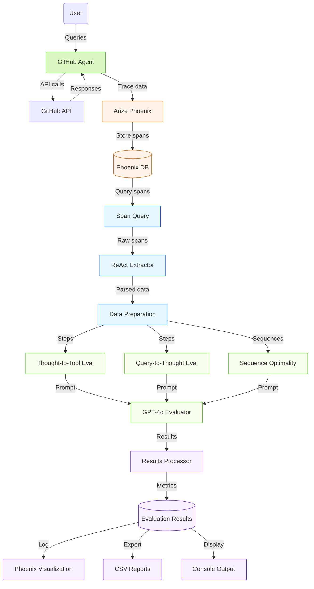

# GitHub Agent Evaluation Framework

## Introduction

This presentation introduces a comprehensive evaluation framework for GitHub agents built on LlamaIndex with Arize Phoenix telemetry. Our framework addresses a critical gap in agent system development: robust, automated evaluation of agent reasoning, tool selection, and execution efficiency.

### Why Agent Evaluation Matters

- Agents perform complex reasoning and make tool-calling decisions that affect outcomes
- Traditional metrics (success/failure) don't capture reasoning quality
- Poor intermediate decisions can lead to brittle agents prone to failure
- Understanding agent thinking enables targeted improvements

## Architecture Overview



Our evaluation framework implements a multi-stage pipeline that captures and analyzes agent interactions:

1. **User & Agent Interaction**: 
   - User submits GitHub-related tasks to the agent
   - Agent processes requests using ReAct (Reasoning + Acting) framework
   - Agent interacts with GitHub API to perform actions

2. **Telemetry & Data Collection**:
   - Phoenix tracing captures agent's thought process and tool calls
   - Raw spans are stored in Phoenix database for analysis
   - Span Query DSL extracts relevant LLM interaction data

3. **Component Extraction**:
   - ReAct Extractor parses thoughts, tool calls, and inputs from spans
   - Data Preparation module organizes extracted components for evaluation
   - Individual steps and sequences are prepared for different evaluations

4. **Three-Dimensional Evaluation**:
   - **Thought-to-Tool**: Evaluates if tool selection matches reasoning
   - **Query-to-Thought**: Assesses if agent's thoughts align with user query
   - **Sequence Optimality**: Analyzes efficiency of overall solution path

5. **LLM-Based Assessment**:
   - GPT-4o evaluates agent performance across all dimensions
   - Structured prompts ensure consistent, detailed evaluations
   - Results include both scores and explanatory feedback

6. **Results Processing & Visualization**:
   - Results are logged to Phoenix for visualization and tracking
   - Detailed CSV reports enable in-depth analysis
   - Console output provides immediate feedback

Our evaluation framework implements a three-stage process:

1. **Trace Collection**: Capture agent interactions via Phoenix telemetry
2. **ReAct Extraction**: Parse thought processes and tool calls
3. **Multi-dimensional Evaluation**: Assess reasoning, tool selection, and execution efficiency

## ReAct Framework & Data Collection

The framework evaluates agents that follow the ReAct (Reasoning + Acting) paradigm:

```
Thought → Action → Action Input → Observation → Thought → ...
```

### Example ReAct Flow

```
Thought: I need to check if the user has any existing repositories first
Action: list_my_repos
Action Input: {}
Observation: [{"name": "project-alpha", "description": "A test project", ...}]
Thought: Now I'll check for open issues in the project-alpha repository
Action: list_issues
Action Input: {"repo": "project-alpha"}
...
```

### Data Extraction Process

```python
def extract_react_components(content):
    """Parse ReAct format to extract thought, tool call, and action input"""
    components = {
        "thought": "",
        "tool_call": "No tool used", 
        "action_input": ""
    }
    
    # Parse content line by line to extract components
    lines = content.split('\n')
    
    # Extract thought - capture everything between "Thought:" and "Action:"
    thought_lines = []
    recording_thought = False
    
    for line in lines:
        line = line.strip()
        if line.startswith("Thought:"):
            recording_thought = True
            # Get content after "Thought:" on same line
            rest_of_line = line[len("Thought:"):].strip()
            if rest_of_line:
                thought_lines.append(rest_of_line)
        elif recording_thought and line.startswith("Action:"):
            recording_thought = False
        elif recording_thought:
            thought_lines.append(line)
    
    components["thought"] = " ".join(thought_lines).strip()
    
    # Extract tool call and action input similarly...
    
    return components
```

The system fetches LLM spans from Phoenix, extracts the ReAct components (thoughts, tool calls, action inputs), and prepares this data for evaluation.

## Evaluation Types

Our framework implements three complementary evaluation dimensions that provide a comprehensive assessment of agent performance. Each evaluation type focuses on a different aspect of agent behavior, allowing for targeted improvements.

### 1. Thought-to-Tool Evaluation

#### What It Evaluates

Thought-to-Tool evaluation assesses whether the agent selected the appropriate GitHub tool based on its stated reasoning. This evaluation focuses on the connection between the agent's internal thought process and its action selection.

#### Key Questions

- Does the chosen tool match the agent's stated intent?
- Are the parameters provided to the tool appropriate for the task?
- Is the tool selection logically consistent with the agent's reasoning?

#### Implementation Details

The evaluation uses GPT-4o to analyze the relationship between an agent's thought and its subsequent tool selection. It receives the original user query, the agent's thought, the tool called, and the action input parameters.

#### Evaluation Query Template

```
You are an evaluation assistant looking at a conversational GitHub agent that uses tools to complete tasks. You're analyzing whether the agent chose the right GitHub tool based on its stated reasoning.

The agent follows a ReAct format: Thought → Action → Action Input → Observation. The "Thought" section contains the agent's reasoning, "Action" is the tool it chose, and "Action Input" contains the parameters for that tool.

Your job is to determine if the "Action" (tool choice) makes sense given the "Thought" (agent's reasoning).

    [BEGIN DATA]
    ************
    [Original Question]: {original_question}
    ************
    [Agent's Thought]: {thought}
    ************
    [Tool Called]: {tool_call}
    ************
    [Tool Action Input]: {action_input}
    [END DATA]

Your task is to:
1. Identify what the agent is trying to accomplish in its current thought
2. Determine if the chosen tool is appropriate for accomplishing that specific goal
3. Make sure the parameters in the action input match what's needed for that goal

Your response must be a single word, either "correct" or "incorrect".

"correct" means:
- The tool choice directly addresses what the agent said it wanted to do in its thought
- The parameters in the action input are appropriate for that specific task

"incorrect" means:
- The tool doesn't match what the agent said it wanted to do in its thought
- The parameters are missing important information or contain incorrect values

[Available GitHub Tools]: {tool_definitions}

Please provide a clear EXPLANATION of your reasoning first, then end with the LABEL. Focus only on whether the tool choice makes sense given the agent's thought.

Example response:
************
EXPLANATION: Looking at the agent's thought, it wants to [what the agent is trying to do]. The tool it selected is [tool name], which [analysis of why this tool is right or wrong for this specific purpose]. The parameters it provided [analysis of whether parameters match the intent].

Based on this analysis, the tool call is...

LABEL: "correct" or "incorrect"
************

EXPLANATION:
```

#### Example Evaluation

**Input**:
- **User Query**: "Create a new repository with a README file"
- **Agent Thought**: "I need to create a new repository with a README file. First, I'll create the repo."
- **Tool Called**: `create_repo`
- **Action Input**: `{"name": "new-project", "description": "A new project"}`

**Evaluation Output**:
```
EXPLANATION: Looking at the agent's thought, it wants to create a new repository, which is the first step toward fulfilling the user's request to create a repository with a README. The tool it selected is create_repo, which is the appropriate tool for creating a new repository. The parameters it provided include a name for the repository ("new-project") and a description ("A new project"), which are the essential parameters needed for repository creation.

Based on this analysis, the tool call is...

LABEL: "correct"
```

#### Code Implementation

```python
# Create evaluation template for thought-to-tool
thought_tool_template = ClassificationTemplate(
    rails=rails,
    template=IMPROVED_TOOL_CALLING_TEMPLATE,
    explanation_template=IMPROVED_TOOL_CALLING_TEMPLATE,
    scores=[1, 0]
)

# Run evaluation
thought_tool_classifications = llm_classify(
    data=input_data,
    template=thought_tool_template,
    model=eval_model,
    rails=rails,
    provide_explanation=True,
)

# Calculate accuracy
thought_tool_classifications["score"] = thought_tool_classifications.apply(
    lambda x: 1 if x["label"] == "correct" else 0, axis=1
)
tt_accuracy = thought_tool_classifications["score"].mean() * 100
```

### 2. Query-to-Thought Evaluation

#### What It Evaluates

Query-to-Thought evaluation assesses whether the agent's thinking properly aligns with the user's request. This evaluation focuses on the agent's understanding of user intent and its planning process.

#### Key Questions

- Does the agent understand what the user is asking for?
- Is the agent's current thought relevant to fulfilling the user request?
- Is the agent taking a logical approach to the task?

#### Implementation Details

The evaluation uses GPT-4o to analyze the relationship between the user's query and the agent's thought. It focuses solely on understanding and planning, not on the tools selected.

#### Evaluation Query Template

```
You are an evaluation assistant analyzing a GitHub agent's understanding of user requests.

Your task is to determine if the agent's thought is properly aligned with the user's query.

[BEGIN DATA]
************
[User Query]: {original_question}
************
[Agent's Current Thought]: {thought}
[END DATA]

Evaluate whether the agent's current thought reflects an understanding of and proper approach to the user's query.

Your response must be EXACTLY one of these two words: "correct" or "incorrect".

"correct" means the thought:
- Shows the agent understands the user's request
- Is working on a relevant part of the overall task
- Is taking a logical step toward completing the request

"incorrect" means the thought:
- Misunderstands what the user wants
- Is focused on something irrelevant
- Is proceeding in a way that won't help fulfill the request

First provide your EXPLANATION analyzing how well the thought aligns with the query, then provide your LABEL, following this format exactly:

EXPLANATION: [Your analysis here...]

LABEL: [MUST BE EXACTLY "correct" OR "incorrect"]
```

#### Example Evaluation

**Input**:
- **User Query**: "Fix the bug in issue #42 of the project-alpha repo"
- **Agent Thought**: "I need to first check if issue #42 exists in the project-alpha repository and understand what the bug is."

**Evaluation Output**:
```
EXPLANATION: The agent's thought directly addresses the user's request to fix a bug in issue #42 of the project-alpha repository. The agent is taking a logical first step by planning to verify the issue exists and understand the nature of the bug before attempting to fix it. This is a methodical approach that demonstrates the agent properly understands what the user wants and is working on a relevant part of the task.

LABEL: correct
```

#### Code Implementation

```python
# Create template for query-to-thought evaluation
query_thought_template = ClassificationTemplate(
    rails=rails,
    template=QUERY_TO_THOUGHT_TEMPLATE,
    explanation_template=QUERY_TO_THOUGHT_TEMPLATE,
    scores={"correct": 1, "incorrect": 0}
)

# Run evaluation
query_thought_classifications = llm_classify(
    data=query_thought_data,
    template=query_thought_template,
    model=eval_model,
    rails=rails,
    provide_explanation=True,
)

# Calculate accuracy
query_thought_classifications["score"] = query_thought_classifications.apply(
    lambda x: 1 if x["label"] == "correct" else 0, axis=1
)
qt_accuracy = query_thought_classifications["score"].mean() * 100
```

### 3. Sequence Optimality Evaluation

#### What It Evaluates

Sequence Optimality evaluation assesses whether the agent chose an efficient path to accomplish the task. Unlike the other evaluations that look at individual steps, this evaluation considers the entire sequence of actions.

#### Key Questions

- Did the agent use the minimum necessary steps to complete the task?
- Were there any redundant or unnecessary operations?
- Did the agent follow a logical workflow that aligns with GitHub best practices?
- Did the agent avoid context switching between unrelated subtasks?

#### Implementation Details

The evaluation groups all interactions for a single query and evaluates the complete sequence of thoughts and tool calls. It considers efficiency, logical flow, and adherence to best practices.

#### Evaluation Query Template

```
You are evaluating whether a GitHub agent took the optimal sequence of steps to accomplish a user's task.

[BEGIN DATA]
************
[User Query]: {original_question}
************
[Complete Thought Sequence]:
{thought_sequence}
************
[Tool Call Sequence]:
{tool_sequence}
[END DATA]

Evaluate whether the agent used the most efficient sequence of thoughts and tool calls to accomplish the task.

Your response must be EXACTLY one of these two words: "optimal" or "suboptimal".

"optimal" means the sequence represents the most efficient approach with no unnecessary steps.
"suboptimal" means a more efficient sequence could have been used.

Please provide a clear EXPLANATION of your reasoning, then end with the LABEL.

EXPLANATION:

LABEL: [MUST BE EXACTLY "optimal" OR "suboptimal"]
```

#### Example Evaluation

**Input**:
- **User Query**: "Create an issue about a login bug in the auth-service repo"
- **Thought Sequence**:
  ```
  Step 1: I need to check if the auth-service repository exists before creating an issue.
  Step 2: Now that I've confirmed the repository exists, I'll create a new issue about the login bug.
  ```
- **Tool Sequence**:
  ```
  Step 1: list_my_repos - {}
  Step 2: open_issue - {"repo": "auth-service", "title": "Login Bug", "body": "There is a bug in the login functionality."}
  ```

**Evaluation Output**:
```
EXPLANATION: The agent took a logical and efficient approach to creating an issue about a login bug. It first verified the existence of the repository before attempting to create an issue, which is a prudent step to avoid errors. After confirming the repository exists, it directly created the issue with appropriate parameters (repo name, title, and description). The sequence contains no unnecessary steps or redundant operations. The agent followed the optimal workflow for this task by first validating the repository exists and then creating the issue with all required information in a single step.

LABEL: optimal
```

#### Data Preparation

```python
def prepare_sequence_data(eval_df):
    # Group by the original query to get all steps for each task
    grouped = eval_df.groupby('question_text')
    
    sequence_data = []
    
    for query, group in grouped:
        # Sort by timestamp if available, otherwise use the dataframe order
        sorted_group = group.reset_index()
        
        # Collect all thoughts and tools in sequence
        thought_sequence = "\n".join([
            f"Step {i+1}: {row['thought']}" 
            for i, (_, row) in enumerate(sorted_group.iterrows())
        ])
        
        tool_sequence = "\n".join([
            f"Step {i+1}: {row['tool_call']} - {row['action_input'][:50]}..." 
            for i, (_, row) in enumerate(sorted_group.iterrows())
        ])
        
        sequence_data.append({
            'original_question': query,
            'thought_sequence': thought_sequence,
            'tool_sequence': tool_sequence
        })
    
    return pd.DataFrame(sequence_data)
```

#### Code Implementation

```python
# Prepare sequence data
sequence_data = prepare_sequence_data(eval_df)

# Create evaluation template
sequence_template = ClassificationTemplate(
    rails=rails,
    template=SEQUENCE_OPTIMALITY_TEMPLATE,
    explanation_template=SEQUENCE_OPTIMALITY_TEMPLATE,
    scores={"optimal": 1, "suboptimal": 0}
)

# Run evaluation
sequence_classifications = llm_classify(
    data=sequence_data,
    template=sequence_template,
    model=eval_model,
    rails=rails,
    provide_explanation=True,
)

# Calculate accuracy
sequence_classifications["score"] = sequence_classifications.apply(
    lambda x: 1 if x["label"] == "optimal" else 0, axis=1
)
seq_accuracy = sequence_classifications["score"].mean() * 100
```

## Technical Implementation

### LLM-Based Evaluation

The framework uses LLM-based evaluation (GPT-4o) to assess agent performance:

```python
# Create evaluation models
eval_model = OpenAIModel(model="gpt-4o")

# Run THOUGHT-TO-TOOL evaluation
thought_tool_template = ClassificationTemplate(
    rails=rails,
    template=IMPROVED_TOOL_CALLING_TEMPLATE,
    explanation_template=IMPROVED_TOOL_CALLING_TEMPLATE,
    scores=[1, 0]
)

thought_tool_classifications = llm_classify(
    data=input_data,
    template=thought_tool_template,
    model=eval_model,
    rails=rails,
    provide_explanation=True,
)
```

### Tool Definitions

The system defines GitHub tools with enhanced descriptions:

```python
# Create enhanced tool definitions with examples
tool_definitions = ""
for tool in tools:
    tool_name = tool.__name__
    tool_desc = tool.__doc__ or "No description available"
    
    # Add enhanced descriptions for common tools
    if tool_name == "update_file_content":
        tool_desc += " This tool is used to create or update files in a repository, including README files."
    elif tool_name == "commit_file":
        tool_desc += " This tool is used to commit code or text files to a repository."
    
    tool_definitions += f"\n{tool_name}: {tool_desc}\n"
```

### Sequence Data Preparation

For sequence evaluation, the system groups interactions by query:

```python
def prepare_sequence_data(eval_df):
    # Group by the original query to get all steps for each task
    grouped = eval_df.groupby('question_text')
    
    sequence_data = []
    
    for query, group in grouped:
        # Sort by timestamp if available, otherwise use the dataframe order
        sorted_group = group.reset_index()
        
        # Collect all thoughts and tools in sequence
        thought_sequence = "\n".join([
            f"Step {i+1}: {row['thought']}" 
            for i, (_, row) in enumerate(sorted_group.iterrows())
        ])
        
        tool_sequence = "\n".join([
            f"Step {i+1}: {row['tool_call']} - {row['action_input'][:50]}..." 
            for i, (_, row) in enumerate(sorted_group.iterrows())
        ])
        
        sequence_data.append({
            'original_question': query,
            'thought_sequence': thought_sequence,
            'tool_sequence': tool_sequence
        })
    
    return pd.DataFrame(sequence_data)
```

## Results & Analysis

### Evaluation Metrics

The framework provides multiple metrics:

1. **Thought-to-Tool Accuracy**: Percentage of tool selections that match agent reasoning
2. **Query-to-Thought Accuracy**: Percentage of thoughts that properly align with user queries
3. **Sequence Optimality**: Percentage of interactions that follow efficient paths
4. **Combined Accuracy**: Percentage of interactions that perform well across all dimensions
5. **Tool Usage Breakdown**: Frequency of each tool's usage

### Visualization & Integration

Results are:
1. Saved as CSV files for detailed analysis
2. Logged to Phoenix for visualization
3. Displayed in console output for immediate review

```python
# Log to Phoenix
px.Client().log_evaluations(
    SpanEvaluations(eval_name="GitHub Tool Calling Eval (Thought-to-Tool)", 
                    dataframe=thought_tool_classifications),
)

px.Client().log_evaluations(
    SpanEvaluations(eval_name="GitHub Query Interpretation Eval (Query-to-Thought)", 
                    dataframe=query_thought_classifications),
)

px.Client().log_evaluations(
    SpanEvaluations(eval_name="GitHub Sequence Optimality Eval", 
                    dataframe=sequence_classifications),
)
```

### Sample Output Analysis

```
Query-to-Thought accuracy: 92.35%
Thought-to-Tool accuracy: 87.56%
Sequence Optimality accuracy: 78.43%
Combined accuracy (both correct): 73.42%

Tool Usage Breakdown:
  list_my_repos: 15 uses
  read_file: 12 uses
  commit_file: 8 uses
  list_issues: 7 uses
  open_issue: 5 uses
  ...
```

## Technical Deep Dive: ReAct Extraction

The extraction of ReAct components is critical to reliable evaluation:

```python
# Function to safely extract React components from the LLM output messages
def get_react_components(row):
    try:
        outputs = row['outputs']
        
        # Handle structure where it's a list of message objects
        if isinstance(outputs, list) and len(outputs) > 0:
            message = outputs[0].get('message', {})
            content = message.get('content', '')
            return extract_react_components(content)
            
        # Handle structure where it's a string that needs parsing
        elif isinstance(outputs, str):
            try:
                parsed_outputs = json.loads(outputs)
                if isinstance(parsed_outputs, list) and len(parsed_outputs) > 0:
                    message = parsed_outputs[0].get('message', {})
                    content = message.get('content', '')
                    return extract_react_components(content)
            except:
                pass
        
        # Check the output field if exists
        if 'output' in row:
            output = row['output']
            if isinstance(output, dict) and 'value' in output:
                content = output.get('value', '')
                return extract_react_components(content)
                
        return {"thought": "", "tool_call": "No tool used", "action_input": ""}
    except Exception as e:
        print(f"Error extracting React components: {str(e)}")
        return {"thought": "", "tool_call": "No tool used", "action_input": ""}
```

The code handles multiple potential data formats:
- Structured message objects
- JSON strings
- Direct output values

## Technical Deep Dive: Evaluation Templates

The evaluation templates are carefully designed to ensure consistent, high-quality assessments:

```python
IMPROVED_TOOL_CALLING_TEMPLATE = """
You are an evaluation assistant looking at a conversational GitHub agent that uses tools to complete tasks. You're analyzing whether the agent chose the right GitHub tool based on its stated reasoning.

The agent follows a ReAct format: Thought → Action → Action Input → Observation. The "Thought" section contains the agent's reasoning, "Action" is the tool it chose, and "Action Input" contains the parameters for that tool.

Your job is to determine if the "Action" (tool choice) makes sense given the "Thought" (agent's reasoning).

    [BEGIN DATA]
    ************
    [Original Question]: {original_question}
    ************
    [Agent's Thought]: {thought}
    ************
    [Tool Called]: {tool_call}
    ************
    [Tool Action Input]: {action_input}
    [END DATA]

Your task is to:
1. Identify what the agent is trying to accomplish in its current thought
2. Determine if the chosen tool is appropriate for accomplishing that specific goal
3. Make sure the parameters in the action input match what's needed for that goal

Your response must be a single word, either "correct" or "incorrect".

[Available GitHub Tools]: {tool_definitions}

Please provide a clear EXPLANATION of your reasoning first, then end with the LABEL.
"""
```

This template:
1. Clearly defines the evaluation task
2. Provides all necessary context
3. Structures the response format
4. Gives access to tool definitions for informed assessment

## Future Directions & Extensions

### Potential Improvements

1. **Fine-grained Tool Parameter Evaluation**:
   - Evaluate parameter quality and completeness
   - Detect invalid parameter combinations

2. **Multi-step Planning Evaluation**:
   - Assess the agent's ability to create and follow plans
   - Evaluate handling of error conditions and recovery

3. **User Alignment Metrics**:
   - Measure how well agent actions align with user intent beyond query interpretation
   - Evaluate personalization to user preferences

4. **Cross-agent Comparative Analysis**:
   - Benchmark multiple agent implementations against each other
   - Identify technique and architecture advantages

### Integration Opportunities

1. **Continuous Evaluation Pipeline**:
   - Automate evaluation in CI/CD pipelines
   - Track performance across agent versions

2. **Real-time Agent Monitoring**:
   - Live evaluation of production agent systems
   - Alert on performance degradation

3. **Training Signal Integration**:
   - Use evaluation results to generate training data
   - Close the loop with RLHF or other learning approaches

## Conclusion

This GitHub Agent Evaluation Framework provides:

1. **Multi-dimensional assessment** of agent reasoning, tool selection, and efficiency
2. **Detailed, explainable metrics** through LLM-based evaluation
3. **Integration with Phoenix** for comprehensive visualization and analysis
4. **Extensible architecture** for additional evaluation dimensions

By evaluating not just outcomes but reasoning quality, the framework enables targeted improvements to agent systems and deeper understanding of agent behavior.

---

## References

1. ReAct: Synergizing Reasoning and Acting in Language Models (Yao, et al.)
2. LlamaIndex Agent Framework Documentation
3. Arize Phoenix Telemetry Documentation
4. GPT-4 Technical Report (OpenAI)
5. Evaluating LLM Reasoning (Zaib, et al.)
